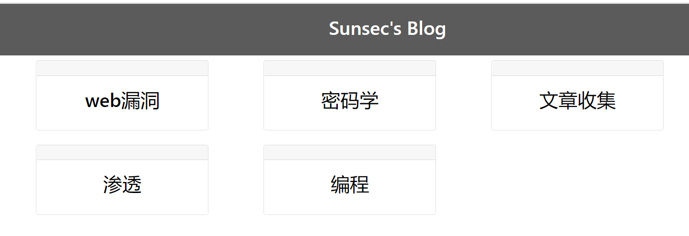
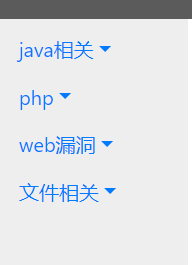
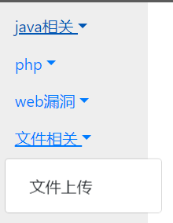
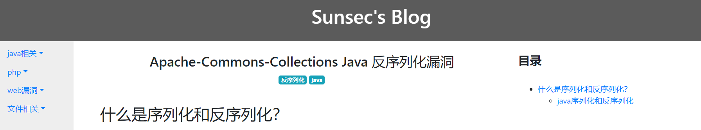
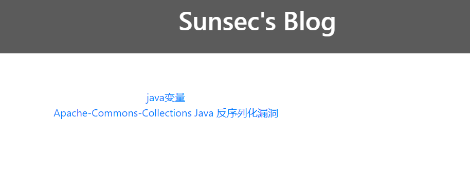
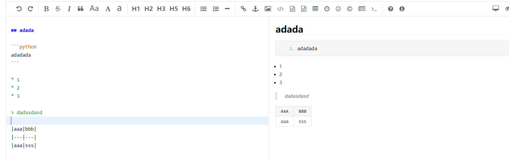

## 简介

博客部署环境：

* Django2
* python3.7
* bootstrap 4
* sqlite 3


本博客是一款简洁的博客系统，可以用来记录平时的学习笔记。博客的主要特点是可以分类明确(支持三级分类),可以用来对知识归类。

## 功能介绍

博客最大的特点就是支持三级分类(归档)，在首页``http://127.0.0.1:8000/blog``会显示第一级分类，每一个类都对应着一个文章列表。



每一个卡片都是一个分类，每个分类对应着一个文章列表

进入第一级分类以后，就会一个二级分类的列表



每一个二级分类都是都是一个下拉列表，里面由具体的文章名



点击下拉列表里面的文章名，就可以查看文章了



文章支持markdown，页面右侧是对文章标题整理的目录。

博客在支持分类归档的同时，也支持标签功能，点击标签以后就可以看到所有支持该标签的文章



点击链接后就可以查看具体的文章。

同时后台支持markdwon，可以直接在后台写文章然后提交



## 使用

```
python manager.py runserver
```

同时在使用时，第一级分类的添加不能再后台添加，需要在数据库中操作，推荐两种方法

* 执行 ``python manager shell``之后，使用ORM相关语法进行添加
* 使用工具Navicat进行添加

之后的文章、tag、二级类别可以直接在后台添加。

同时第一级目录添加时，其slug字段的形式为``xxxx-list``，之后的目录没有要求。在使用时还要修改应用下的``urls.py``文件，修改其中的分类名，以及views.py中的分类函数名。修改成自己的分类后。之后的文章添加、tag、二级分类都可在后台操作。


## 声明

由于本人前端只会一点皮毛，所以博客的主题是走简介风格的，同时我认为博客就应该是一个总结,归类知识的地方，所以只添加了三级归档、tag等功能。评论，文章推荐等功能都没有实现，如果想要添加这些功能的话，可以参考我的博客。

